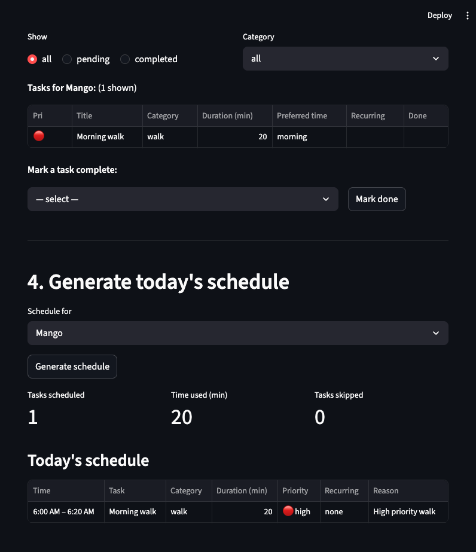

# PawPal+ (Module 2 Project) 🐾

This is **PawPal+**, a Streamlit app that helps a pet owner plan care tasks for their pet!
## Demo

<a></a>

## Scenario

A busy pet owner needs help staying consistent with pet care. They want an assistant that can:
 
- Track pet care tasks (walks, feeding, meds, enrichment, grooming, etc.)
- Consider constraints (time available, priority, owner preferences)
- Produce a daily plan and explain why it chose that plan

Your job is to design the system first (UML), then implement the logic in Python, then connect it to the Streamlit UI.

## Features

### Priority-based scheduling
Tasks are sorted by priority level (High → Medium → Low) before scheduling begins. When two tasks share the same priority, the one preferred earlier in the day (morning before afternoon before evening) is scheduled first. This means the owner's most critical care tasks always claim time budget before lower-priority ones.

### Sorting by time
The generated daily plan is always displayed in chronological order regardless of the order tasks were added. `DailyPlan.sort_by_time()` sorts by a zero-padded 24h string (`"07:30"`, `"13:15"`) so no integer conversion is needed and the order is always correct.

### Daily and weekly recurrence
Tasks can repeat on a `daily` or `weekly` cadence. When a recurring task is marked complete, `Pet.complete_task()` calls `PetTask.renew()` to produce a fresh copy due the next day or week using `timedelta` — so month and year boundaries are handled correctly automatically. The renewal is appended to the pet's task list and the UI shows a confirmation toast with the next due date.

### Conflict warnings
The scheduler detects and surfaces two categories of conflict:

- **Crowded window** — four or more tasks compete for the same preferred time slot (e.g. all morning). Shown as a `⚠️` warning in the UI.
- **Time window mismatch** — a task is scheduled outside its preferred time of day because higher-priority tasks consumed that window first. Shown as an `ℹ️` info note so the owner knows why the placement differs from the preference.

### Cross-pet conflict detection
When an owner has more than one pet, `detect_cross_pet_conflicts()` compares the scheduled time slots across all pets' plans. Any two tasks that overlap in time are flagged with a `🚨` error — because the owner cannot physically carry out care for two pets simultaneously.

### Skipped tasks
Tasks that exceed the owner's total time budget are collected in `DailyPlan.skipped_tasks` and shown in a dedicated expander with a plain-English explanation. Previously these were silently dropped.

### Filtering and status tracking
The task list can be filtered by completion status (all / pending / completed) and by category (walk, feed, meds, grooming, enrichment, other). The filtered view is always sorted by priority so the most important pending tasks appear at the top.

---

## Smarter scheduling

Tasks are scheduled sequentially in one pass, highest priority first. This means a single long high-priority task can consume time that would have fit two shorter lower-priority tasks. The trade-off is intentional: critical care (medications, feeding) is never bumped by lower-priority enrichment tasks, even if packing the schedule more tightly would fit more tasks overall.

---

## Getting started

### Setup

```bash
python -m venv .venv
source .venv/bin/activate  # Windows: .venv\Scripts\activate
pip install -r requirements.txt
```

### Run the app

```bash
streamlit run app.py
```

### Suggested workflow

1. Read the scenario carefully and identify requirements and edge cases.
2. Draft a UML diagram (classes, attributes, methods, relationships).
3. Convert UML into Python class stubs (no logic yet).
4. Implement scheduling logic in small increments.
5. Add tests to verify key behaviors.
6. Connect your logic to the Streamlit UI in `app.py`.
7. Refine UML so it matches what you actually built.

---

## Testing

Tests live in `tests/test_pawpal.py` and can be run with:

```bash
python -m pytest tests/ -v
```

The test suite covers 22 cases across five areas:

**Sorting**
- Tasks are returned in chronological order after `sort_by_time()`
- High-priority tasks appear before low-priority ones after `_sort_by_priority()`
- Among equal-priority tasks, morning comes before evening (tiebreaker)
- `to_table()` rows are in chronological order regardless of insertion order

**Recurrence logic**
- Completing a daily task appends a renewal due the next day
- Completing a weekly task appends a renewal due seven days later
- A non-recurring task's `renew()` returns `None`
- Completing an already-completed task does not create a duplicate renewal
- Renewal across a month boundary (e.g. Jan 31 → Feb 1) is handled correctly

**Conflict detection**
- A task scheduled outside its preferred time window appears in `plan.conflicts`
- Two pets with overlapping time slots produce a cross-pet conflict warning
- Back-to-back tasks (one ends exactly when the next begins) are not flagged
- Four or more tasks sharing a preferred window trigger a crowded-window warning

**Budget and feasibility**
- A task whose duration exactly equals the remaining budget is scheduled (not skipped)
- A task exceeding the total time budget lands in `skipped_tasks`, not silently dropped
- An empty task list produces a valid empty plan without errors

**`filter_tasks` utility**
- An unrecognised pet name returns an empty list
- `completed=None` returns all tasks regardless of status
- An owner with no pets returns an empty list