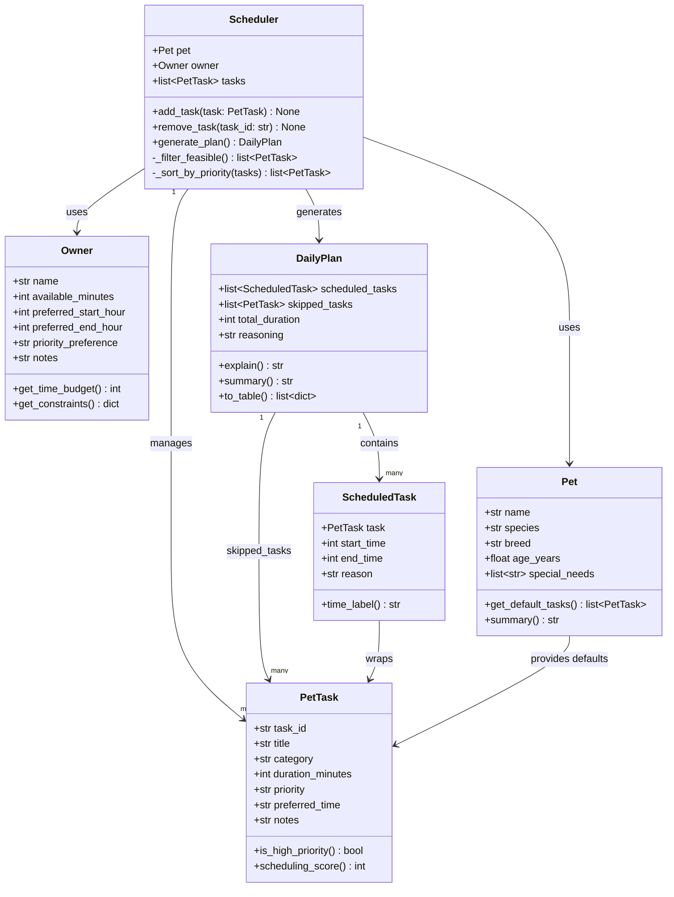

# PawPal+ UML Class Diagram

```mermaid
classDiagram
    class PetTask {
        +str task_id
        +str title
        +str category
        +int duration_minutes
        +str priority
        +str preferred_time
        +str notes
        +is_high_priority() bool
        +scheduling_score() int
    }

    class Pet {
        +str name
        +str species
        +str breed
        +float age_years
        +list~str~ special_needs
        +get_default_tasks() list~PetTask~
        +summary() str
    }

    class Owner {
        +str name
        +int available_minutes
        +int preferred_start_hour
        +int preferred_end_hour
        +str priority_preference
        +str notes
        +get_time_budget() int
        +get_constraints() dict
    }

    class Scheduler {
        +Pet pet
        +Owner owner
        +list~PetTask~ tasks
        +add_task(task: PetTask) None
        +remove_task(task_id: str) None
        +generate_plan() DailyPlan
        -_filter_feasible() list~PetTask~
        -_sort_by_priority(tasks) list~PetTask~
    }

    class DailyPlan {
        +list~ScheduledTask~ scheduled_tasks
        +list~PetTask~ skipped_tasks
        +int total_duration
        +str reasoning
        +explain() str
        +summary() str
        +to_table() list~dict~
    }

    class ScheduledTask {
        +PetTask task
        +int start_time
        +int end_time
        +str reason
        +time_label() str
    }

    Scheduler --> Pet : uses
    Scheduler --> Owner : uses
    Scheduler "1" --> "many" PetTask : manages
    Scheduler --> DailyPlan : generates
    DailyPlan "1" --> "many" ScheduledTask : contains
    DailyPlan "1" --> "many" PetTask : skipped_tasks
    ScheduledTask --> PetTask : wraps
    Pet --> PetTask : provides defaults
```
