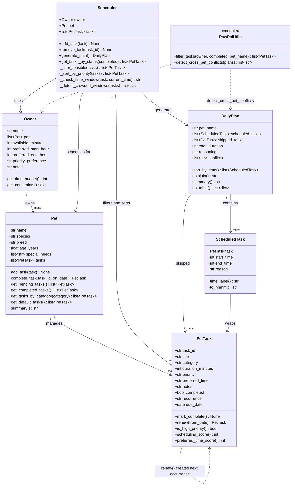

# PawPal+ UML Class Diagram

```mermaid
classDiagram
    class PetTask {
        +str task_id
        +str title
        +str category
        +int duration_minutes
        +str priority
        +str preferred_time
        +str notes
        +bool completed
        +str recurrence
        +date due_date
        +mark_complete() None
        +renew(from_date) PetTask
        +is_high_priority() bool
        +scheduling_score() int
        +preferred_time_score() int
    }

    class Pet {
        +str name
        +str species
        +str breed
        +float age_years
        +list~str~ special_needs
        +list~PetTask~ tasks
        +add_task(task) None
        +complete_task(task_id, on_date) PetTask
        +get_pending_tasks() list~PetTask~
        +get_completed_tasks() list~PetTask~
        +get_tasks_by_category(category) list~PetTask~
        +get_default_tasks() list~PetTask~
        +summary() str
    }

    class Owner {
        +str name
        +list~Pet~ pets
        +int available_minutes
        +int preferred_start_hour
        +int preferred_end_hour
        +str priority_preference
        +str notes
        +get_time_budget() int
        +get_constraints() dict
    }

    class Scheduler {
        +Owner owner
        +Pet pet
        +list~PetTask~ tasks
        +add_task(task) None
        +remove_task(task_id) None
        +generate_plan() DailyPlan
        +get_tasks_by_status(completed) list~PetTask~
        -_filter_feasible(tasks) list~PetTask~
        -_sort_by_priority(tasks) list~PetTask~
        -_check_time_window(task, current_time) str
        -_detect_crowded_windows(tasks) list~str~
    }

    class DailyPlan {
        +str pet_name
        +list~ScheduledTask~ scheduled_tasks
        +list~PetTask~ skipped_tasks
        +int total_duration
        +str reasoning
        +list~str~ conflicts
        +sort_by_time() list~ScheduledTask~
        +explain() str
        +summary() str
        +to_table() list~dict~
    }

    class ScheduledTask {
        +PetTask task
        +int start_time
        +int end_time
        +str reason
        +time_label() str
        +to_hhmm() str
    }

    class PawPalUtils {
        <<module>>
        +filter_tasks(owner, completed, pet_name) list~PetTask~
        +detect_cross_pet_conflicts(plans) list~str~
    }

    Owner "1" --> "many" Pet : owns
    Pet "1" --> "many" PetTask : manages
    Scheduler --> Owner : uses
    Scheduler --> Pet : schedules for
    Scheduler "1" --> "many" PetTask : filters and sorts
    Scheduler --> DailyPlan : generates
    DailyPlan "1" --> "many" ScheduledTask : contains
    DailyPlan "1" --> "many" PetTask : skipped
    ScheduledTask --> PetTask : wraps
    PetTask ..> PetTask : renew() creates next occurrence
    PawPalUtils ..> Owner : reads pets from
    PawPalUtils ..> DailyPlan : detect_cross_pet_conflicts
```
